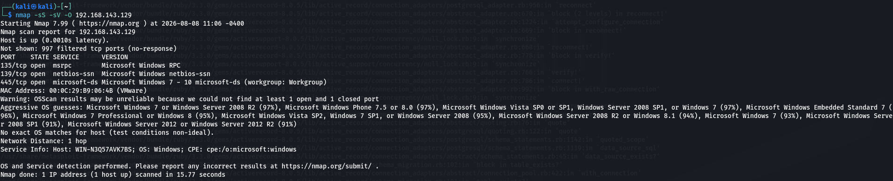

# Project 01 — Network Mapping & Service Discovery

## Objective
Perform network discovery and service enumeration against an intentionally vulnerable Windows virtual machine inside a private VMware lab.

## Lab Environment
- VMware Workstation Pro
- Kali Linux
- Windows 7 virtual machine
- Nmap

## Methodology
1. Connected the Kali and Windows VMs to the same isolated virtual network.
2. Identified the target VM within the lab.
3. Performed TCP SYN, service-version, and OS-detection scanning.
4. Reviewed discovered services and considered their security implications.

## Observations
The lab identified common Windows services including RPC, NetBIOS/SMB, and Microsoft-DS. Exposed SMB services on legacy systems can increase security risk when systems are unpatched or improperly configured.

## Evidence

## Key Learnings
- Understood the purpose of host and service discovery.
- Practiced interpreting Nmap scan results.
- Learned why legacy network services should be minimized, monitored, and properly patched.

## Defensive Takeaways
- Keep operating systems and network services patched.
- Disable unnecessary services and ports.
- Restrict SMB exposure with host/network firewall rules.
- Continuously monitor network assets and unexpected open ports.

> **Lab note:** Testing was performed only in an authorized private virtual environment.
